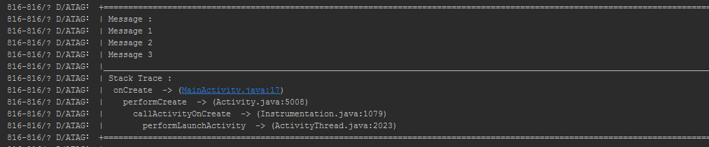
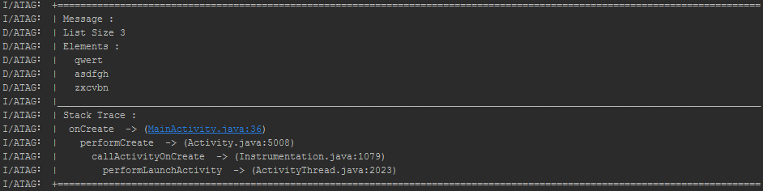

# AndroidLog
AndroidLog - Simple Android Logs

##Usage

###Adding Library

you just add the following dependency to your build.gradle:

```groovy 
 dependencies {  
    repositories {
        mavenCentral()
    }
    compile 'com.anwios.alog:android-log:1.1.0'
  }
```
### example codes
```java
        Logs.d("Message 1", "Message 2", "Message 3");
        Logs.d(1, 2, 3);
        Logs.d(1.2, .13);
        Logs.toast(context, "Hello");
        Logs.setHierarchy(2).setTag("ALOG");
        
        List list=new ArrayList<String>();
        list.add("qwert");
        list.add("asdfgh");
        list.add("zxcvbn");
        Logs.a(list);

        EditText b=new EditText(context);
        b.setText("Helllo");
        Logs.a(b);

        File f=new File("/hello");
        Logs.a(f);
 ```
 sample  1
 
 
 sample 2
 
## Contributions

Any contributions are welcome! 

## Developed By
* Nooh - <nooh64@gmail.com> 

## License

    Copyright 2014 NOOH KVM

    Licensed under the Apache License, Version 2.0 (the "License");
    you may not use this file except in compliance with the License.
    You may obtain a copy of the License at

        http://www.apache.org/licenses/LICENSE-2.0

    Unless required by applicable law or agreed to in writing, software
    distributed under the License is distributed on an "AS IS" BASIS,
    WITHOUT WARRANTIES OR CONDITIONS OF ANY KIND, either express or implied.
    See the License for the specific language governing permissions and
    limitations under the License.
